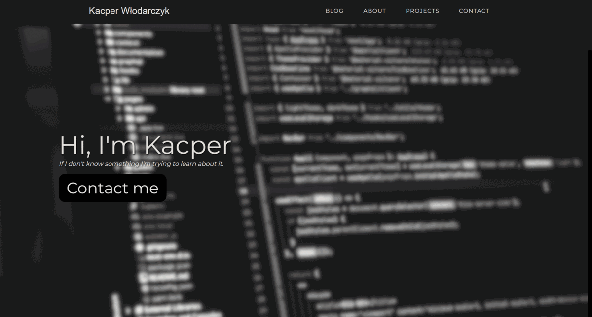

## PORTFOLIO WEB SITE + BLOG
This is my first web and Django project. In this project I used: Python, Django, HTML, CSS, and JAVASCRIPT.
Here you can download all files and customise them for your self. In the link down below you can see my full version of 
this project.
Also down below I will tell you everything about configuration. 

## Demo

http://deenuu1.pythonanywhere.com/

## Documentation

The first thing after u download this file is to do:

1. Download Django - pip install Django
2. Downaload tinymce - pip install django-tinymce
3. And also - pip install Django-TinyMCE-lite
4. In the terminal type "cd my website"
4. Open a terminal and write "py manage.py makemigrations"
5. Then write "py manage.py migrate"
6. After that you can create admin  by typing in the terminal "py manage.py createsuperuser"
7. And the last thing is to run the local server by typing in the terminal "py manage.py runserver"

## What's next? 

Now you can customise files for yourself. It's very easy so I know that you can do that.
Good luck!
## FAQ

#### How to push it to the internet? 

If u are a beginner like me I recommend you to use 'pythonanywhere' It's 100% free hosting

#### Does everything work?

it depends. I made a full configuration for a custom ERROR 404 PAGE but it doesn't work with the static file.

### Admin panel 

It works on localhost but not on the hosting. I gonna repair that in my free time.

## Authors

- [@DEENUU1](https://www.github.com/DEENUU1)

